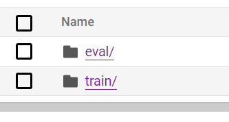
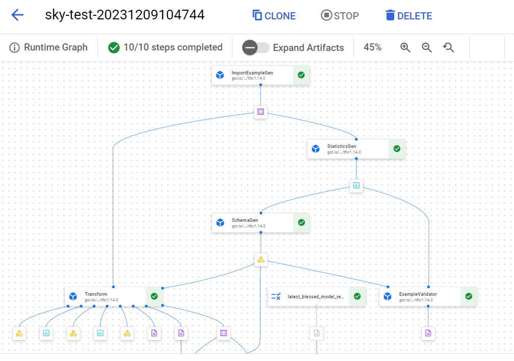
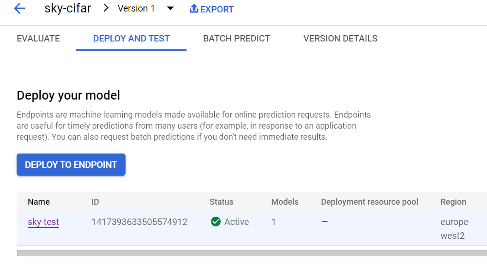

**Sky Interview MLE Technical Test**

**Test description**

cifar_model.py is a barebones script developed on a local machine that
trains a simple tensorflow estimator on the CIFAR 10 image dataset.
Using the code in the script as a starting point:

1.  Update the model specification to include an additional
    convolutional layer containing 16 filters with a kernel size of 3.

2.  Add a max pooling layer after each of the convolutional layers to
    reduce the dimensionality of the outputs passed to the next layer.

3.  Add a callback to save a model checkpoint after every training
    epoch.

-   Define a simple Vertex AI pipeline that:

    -   Trains the model as specified in part (3).

    -   Uploads the trained model to Vertex AI as a model resource.

    -   Deploys the model resource to the an endpoint resource.

-   Provide code to compile and run the pipeline.

You are free implement the Vertex AI pipeline as you see fit, including
the use of pre-built components if appropriate. The only requirement is
that the completed pipeline contains at least two distinct components.
All pipeline artifacts should be persisted to Google Cloud Storage.

Please provide your code to define, compile, and run the pipeline in a
jupyter notebook along with brief but clear commentary describing the
process as you go. A requirements.txt file should be provided alongside
this detailing any dependencies that will need to be installed to run
the code. Any parameters required to run the code in a different google
cloud project (e.g. project name, region, artifacts directory, etc.)
should be clearly defined at the start of the notebook so that they can
be populated by the user. You can assume that the notebook will be run
in an environment where the required google cloud services are already
authorised.

Focus on delivering the essential functionality outlined above, there
will be opportunity to expand on how you would improve on your solution
in the subsequent interview round.

**Test result**

**Step 1. Download CIFAR10 TFRecords files**

1\. Run the following Python code in Jupyter notebook / Python terminal:

> import tensorflow_datasets as tfds
>
> datasets, info = tfds.load(name=\'cifar10\', with_info=True,
> as_supervised=True)

TFRecords files can be found in
C:\\Users\\\<user\>\\tensorflow_datasets\\cifar10\\3.0.2:

-   cifar10-train.tfrecord-00000-of-00001

-   cifar10-test.tfrecord-00000-of-00001

2\. Create a GCP bucket for the source files

3\. Upload TFRecords files to the bucket in 'eval' and 'train' folders.

{width="2.3125in" height="1.2361111111111112in"}

**Step 2 Generate and run a Vertex pipeline**

Start Jupyter notebook. Open the notebook and install dependencies:\
pip install tfx

If you see this error \"cannot import name \'WKBWriter\' from
\'shapely.geos\' when\"

pip install -U google-cloud-aiplatform \"shapely\<2\"

Once all packages installed run all cells up to the one which submits
the pipeline to Vertex.

{width="6.6930555555555555in"
height="4.700694444444444in"}

**Step 3 Upload the model to an endpoint**

Wait the pipeline to be finished (around 15-20 minutes).

Create an endpoint with the function provided in the notebook.

Create a model in Vertex registry from the destination path with the
function provided.

Upload the model to the endpoint with the function provided.

Check the model in the endpoint:

{width="5.613888888888889in"
height="3.0701388888888888in"}
